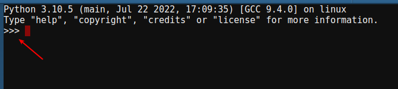

# Módulo 01. Aspectos básicos de Python

## 🤚🏻 Antes de empezar, ¿qué es replit.com?
  Replit.com es un espacio de trabajo colaborativo en línea que contiene un editor de código donde podemos programar en Python (además de en otros lenguajes) utilizando un __Idle__ (este es el nombre que recibe la consola o _shell_ de Python) completo y sin limitación.  


 
  
  Fíjate como el punto de partida es siempre el símbolo mayor que ">" también llamado _prompt_. Dicho símbolo puede aparecer triplicado ">>>" en otros editores. 



## ⛏ ¡Empezamos a picar!

Empecemos con algo tan sencillo como es utilizar la función precargada __print()__ la cual nos devolverá en pantalla aquello que tecleemos entre paréntesis y entrecomillado (las cadenas de texto o también llamadas _strings_ deben ir entre comillas). Recordad que para ejecutar el comando hay que pulsar "run" en la parte superior de esta consola.

```python
print('Mi primera línea de código en Python, ¡genial!')
```
Resultado:
> Mi primera línea de código en Python, ¡genial!
---
### 🔴 MD01 Actividad 01

Haz clic en el archivo __"main.py"__ que encontrarás en la parte superior de este módulo y escribe tu primera línea de código. <ins>Escribe una oración simple, la que tú quieras</ins>. Recuerda que aquello que escribas tiene que ir entre paréntesis y también entre comillas (pueden ser simples o dobles, da igual).  

Ejemplo:

```python
print('¡Me encanta esto de ser programador/a!')
```
Resultado:
> ¡Me encanta esto de ser programador/a!

---
## ➕ Ampliación de conocimientos

En Python, cada función debe ir en una línea diferente, por lo que __NO__ es nada recomendable anidar varias de ellas en la misma línea (la cual cosa podemos conseguir con el símbolo ";").  

Ejemplo:

```python
print ('Me llamo Miquel'); print ('y de apellido Nebot.')
```
Resultado:
> Me llamo Miquel\
> y de apellido Nebot.

Como podéis ver, aunque hemos juntado dos funciones en una misma línea (opción poco recomendable, ya que dificulta la lectura del código en caso de tener que analizarlo, reutilizarlo, depurarlo...), el resultado lo secciona en dos.

Si se diera el caso (poco probable) que necesitáramos utilizar diversas líneas para la misma instrucción, podemos forzar el salto de línea con el símbolo barra invertida __"\\\"__. 
 
Ejemplo:
 
 ```python
print ('Esto sería organizar funciones \
en diferentes líneas utilizando barra invertida, \
¿veis qué bien?')
```
Resultado:
>Esto sería organizar funciones en diferentes líneas utilizando barra invertida, ¿veis qué bien?

❗️ Al hilo de todo lo explicado en este apartado, comentar que en algunas guías de estilo se recomienda no exceder de los __79 caracteres por línea__ en Python.  

## 💡 Vale... ¿y si quiero explicar mi código?

Es una práctica muy recomendable documentar nuestro código, es decir, efectuar anotaciones y explicaciones para facilitar la lectura y entendimiento a las personas que intenten utilizar nuestra aplicación en el futuro.  

Lo ideal es hacerlo con el símbolo almohadilla __"#"__. De esta manera iremos comentando líneas en el _idle_ de Python al igual que se hace en otros lenguajes de programación. Dicho símbolo hace posible que podamos redactar anotaciones, explicaciones, aclaraciones... o simplemente que invalidemos una o varias líneas de código de manera temporal si estamos realizando pruebas. Todo lo que siga a __"#"__, el editor lo omitirá y no se tendrá en cuenta en el momento de ejecutar el programa.  

Si el comentario es muy extenso y ocupa varias líneas, podemos seguir utilizando la almohadilla al inicio de cada línea. Aunque en Python es posible utilizar 3 comillas simples o dobles al principio y al final de un bloque de texto, obteniendo el mismo resultado (omisión del texto al ejecutar el código), es importante entender que este texto no se considera técnicamente un comentario, sino un __string literal__. Este string no está asociado a ninguna variable, por lo que Python lo descarta, aunque sigue ocupando espacio en memoria. Por esta razón, no es la mejor práctica para realizar comentarios multilínea generales.

Ejemplo 1: utilizando las comillas simples.

```python
''' Esto técnicamente no sería un comentario multilínea y, por lo tanto,
no es la mejor manera de comentar nuestro código. Recuerda que la opción
recomendada es utilizar la almohadilla al principio de cada línea que
deseemos incluir en nuestro código. '''
```
Resultado:
>-

Ejemplo 2: utilizando las comillas dobles.

```python
""" Esto técnicamente no sería un comentario multilínea y, por lo tanto,
no es la mejor manera de comentar nuestro código. Recuerda que la opción
recomendada es utilizar la almohadilla al principio de cada línea que
deseemos incluir en nuestro código. """
```
Resultado:
>-


## 👍️ Buenas prácticas
La codificación (o en inglés _enconding_) no es más que una simple directriz que colocamos al inicio de nuestros programas para indicarle a Python qué conjunto de caracteres utilizaremos a lo largo del mismo. UTF-8 (_Unicode Transformation Format_) es un formato de codificación de caracteres [Unicode](https://home.unicode.org/) que garantizará que nuestro proyecto pueda ser mostrado en cualquier ordenador sin errores ni caracteres extraños.  

```Python
# -*- coding: utf-8 -*-
print('Funcionará perfectamente con tildes, ñ... lo que queramos.')
```

---
### 🔴 MD01 Actividad 02

Haz clic en el archivo __"main.py"__ y, antes de la oración de la Actividad 01, <ins>haz un comentario usando la tecla almohadilla "#"</ins>.  

Ejemplo:

```python
# -*- coding: utf-8 -*-
# Miquel Nebot · Mayo 2023

print('¡Me encanta esto de ser programador/a!')
```

---
# 🤗 Resumen del Módulo 01

Hasta aquí esta primera lección con los aspectos más básicos de Python. Recuerda que deberías retener los siguientes conceptos:
1. Idle de Python (Shell o consola).
2. Prompt (>) o (>>>).
3. Función.
4. print('Hola mundo').
5. Unicode.
  
También que:  
* En Python cada instrucción deberá aparecer en una línea individual.  
* Podemos utilizar ";" para unir instrucciones en una misma línea.  
* Podemos utilizar la "\\" para fragmentar instrucciones en diversas líneas.  
* Utilizamos "#" para comentar, explicar o impedir que se ejecute alguna instrucción de manera temporal.
* Para comentarios largos que ocupen diversas líneas podemos utilizar 3 comillas simples o dobles para abrir y cerrar.  
