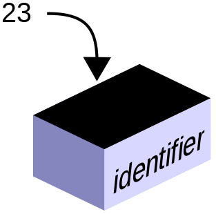
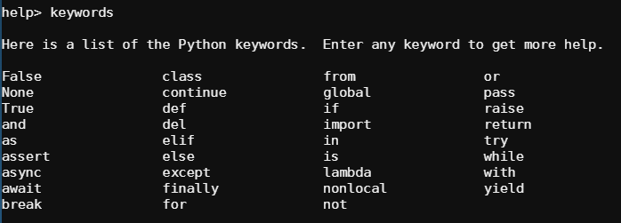

# Módulo 02. Las variables

## ✅ ¿Qué es una variable? ¿Para qué sirve?
  El término __variable__, si no lo has escuchado todavía, no te preocupes que a partir de ya, en clase de Matemáticas será tu nuevo amigo 🙋‍♀️. Generalmente, se representan mediante letras del alfabeto latino (x, y, z, n...) y, dependiendo del tipo de ejercicio donde las veamos incorporadas, tienen un significado u otro.  
  Por ejemplo, el caso más sencillo y con el que seguro que llevas trabajando mucho tiempo es en ejercicios de álgebra. Veamos el ejemplo siguiente:
  
  > x + 5 = 7
  
  Seguro que acabas de adivinar que el valor que se "oculta" tras la letra __x__ es el 2. Pues algo parecido encontramos en los lenguajes de programación cuando hablamos de variables. Podríamos establecer un símil con una <ins>celda o espacio en la memoria donde dejamos unos valores para que el programa, posteriormente los utilice para hacer cualquier función</ins>.

  
Imagen: _CPT-programming-variable.svg_ · <a href="https://creativecommons.org/publicdomain/zero/1.0/deed.en">Wikimedia Commons</a> 

## ⛏ ¡Empezamos a picar!
1️⃣ Para asignar un valor a una variable (guardar un valor en memoria) debemos hacerlo usando letras o palabras completas seguidas del signo __"="__ (en programación no hace la misma función que en matemáticas y aquí es el encargado de "asignar" un valor).  

❓️ ¿Qué debemos tener en cuenta a la hora de definir variables?
* Usaremos <ins>siempre letras o palabras en __minúscula__</ins> para intentar dar un nombre concreto y descriptivo a nuestra variable. Ej. a, n, x, nombre, valor, ciudad...
* Si queremos hacer referencia a <ins>palabras compuestas, utilizaremos el guion bajo</ins> para separarlas __"_"__ (en programación, estilo de escritura conocido como _snake case_). Ej. nombre_completo, codigo_postal, nuevo_valor...
* Utilizaremos el signo igual __"="__ para asignar el valor a nuestra variable. <ins>Antes y después del signo dejaremos un espacio en blanco</ins> (solo 1). Ej. n = 77, nombre = 'Antonio'...
* Si en lugar de definir una variable queremos disponer de <ins>constantes, lo haremos usando letras mayúsculas</ins>. Ej. MI_NOMBRE = 'Miquel'.

Veamos una serie de ejemplos:  

Ejemplo 1: almacenamos una variable.
```python
a = 5
print(a)
```
Resultado:
> 5   

Ejemplo 2: modificamos el valor de una variable.
```Python
a = 5
a = 100
print(a)
```
Resultado:
> 100

Ejemplo 3: almacenamos dos variables y calculamos la suma de ambas.
```python
a = 5
b = 2
x = a + b
print(x)
```
Resultado:
> 7

Ejemplo 4: anidamos variables en una única línea.
```python
valor1,valor2 = [135,409]
print(valor1)
print(valor2)
```
Resultado:
> 135  
> 409

Ejemplo 5: almacenamos cadenas de texto en una variable. Recuerda, comillas simples o dobles (valen igual).
```python
mi_nombre = 'Juan Pedro'
print(mi_nombre)
```
Resultado:
>Juan Pedro

Ejemplo 6: almacenamos dos cadenas de texto y las mostramos a la vez en pantalla. Lo conseguiremos añadiendo como argumento de la función _print()_ la variable 2, 3...
```python
alumna1 = 'Carla Domínguez'
alumno2 = 'Pedro Gomila'
print(alumna1,alumno2)
```
Resultado:
>Carla Domínguez Pedro Gomila

Ejemplo 7: repetimos las cadenas de texto tantas veces como le indiquemos con "*veces".
```python
alimento_favorito = 'Melón'
print(alimento_favorito * 3)
```
Resultado:
>MelónMelónMelón

Ejemplo 8: modificamos el tipo de dato introducido.
```Python
# Establecemos una variable en formato de número entero
primer_numero = 27
print(primer_numero)
print(type(primer_numero)

# Le decimos a PYthon que esta variable pasará a ser una cadena de texto
cambio_primer_numero = str(primer_numero)
print(cambio_primer_numero)
print(type(cambio_primer_numero)
````
Resultado:
> 27
<class 'int'>  
27  
<class 'str'>

---
❗ __Palabras reservadas en Python__  
¡Cuidado! Debes prestar atención a una lista concreta de palabras que <ins>no podrás usar en Python para nombrar variables</ins>, ya que se utilizan para funciones específicas. Para conocer dicha lista basta con teclear "keywords" en el _prompt_ de Python.  

  
Imagen: Intérprete de comandos en línea _python.org_ · <a href="https://www.python.org/shell/">Python.org</a>

---
### 🔴 MD02 Actividad 01
Haz clic en el archivo __"main.py"__ que encontrarás en la parte superior de este módulo y <ins>escribe un total de tres variables que se muestren en pantalla a la vez</ins> con el comando __print()__.  

Ejemplo:

```python
# Variables
amigo1 = 'Juan'
amigo2 = 'Carla'
amigo3 = 'Alba'

# Ejecución de la función
print(amigo1,amigo2,amigo3)
```
Resultado:
> Juan Carla Alba

---
2️⃣ Podemos conseguir que sea el usuario/a quien introduzca el valor a almacenar, lo haremos usando la instrucción __input()__. Fíjate en el ejemplo:  

Ejemplo 1:
```Python
print('Escribe a continuación tu nombre: ')
nombre = input()
print(nombre)
```
Esto devolverá en pantalla el nombre que hayamos introducido después de la pregunta que nos ha hecho el programa.  
Resultado:
> Escribe a continuación tu nombre: Miquel \
> Miquel

Ejemplo 2: simplificamos el ejemplo anterior. El resultado será exactamente el mismo.
```Python
nombre = input('Escribe a continuación tu nombre: ')
print(nombre)
```
Resultado:
> Escribe a continuación tu nombre: Miquel \
> Miquel

---
### 🔴 MD02 Actividad 02
Continuando con el ejemplo anterior, añade la instrucción necesaria para que el programa te haga introducir tu nombre y muestre en pantalla los nombres de tus amigos. Puedes personalizar el texto tanto como quieras para que quede una oración lo más cuidada posible.
````Python
# Variables
amigo1 = 'Juan'
amigo2 = 'Carla'
amigo3 = 'Alba'
mi_nombre = input('Introduce tu nombre: ')

# Ejecución de la instrucción
print('Mi nombre es',mi_nombre,'y los nombres de mis amigos son:',amigo1,amigo2,amigo3)
````

---
## ➕ Ampliación de conocimientos
Como te habrás dado cuenta, la oración anterior que genera tu nueva máquina de _inteligencia artificial_, tiene faltas ortográficas que no debemos pasar por alto.  

  

Como ya sabrás de tus clases de Lenga, los elementos de una enumeración deben ir entre comas y, además, el último elemento precedido de "y". ¡Ah!, y no olvidar el punto antes de finalizar la oración.  
Veamos entonces una __serie de secuencias (llamadas de escape)__ que te permitirán generar textos perfectamente escritos.


### 👉 Salto de línea
Si deseamos saltar una línea en un texto introducido, utilizaremos __"\n"__ dentro de nuestra instrucción.  
Ejemplo:  
````Python
print('Hola:\n\nMi nombre es Alberto y esto aparecerá como si fuera la cabecera de una carta formal, es decir, en dos líneas separando el saludo del cuerpo del mensaje.')
````
Resultado:  
>Hola:
>
>Mi nombre es Miquel y esto aparecerá como si fuera la cabecera de una carta formal, es decir, en dos líneas separando el saludo del cuerpo del mensaje.


### 👉 Separadores
Como supongo que ya habrás notado, cada vez que en el comando __print()__ separamos con comas los elementos, la misma sintaxis introduce un espacio entre los elementos. Si queremos cambiar el tipo de separador lo haremos añadiendo __sep = 'cualquier_elemento'__ a los argumentos de la instrucción.  
Ejemplo:
````Python
print('cebollas','patatas','puerros','calabacín',sep=',')
````
Resultado:  
>cebollas,patatas,puerros,calabacín

Si al elemento separador anterior le añadimos un espacio detrás de la coma __(sep = ', ')__, tendremos una enumeración prácticamente perfecta.

>cebollas, patatas, puerros, calabacín

### 👉 Finalizar
También podemos añadir punto al final añadiendo __end = '.'__ a los argumentos de la instrucción para indicarle a Python que será el punto el signo que acabará nuestra oración.  
Ejemplo:
````Python
print('Estoy practicando como mostrar texto en Python',end='.')
````
Resultado:  
>Estoy practicando como mostrar texto en Python.


### 👉 Caracteres especiales
Se puede dar el caso que necesitemos escribir unas comillas __\" "__ o una barra invertida __"\\"__, por ejemplo, y no vamos a ser capaces de hacerlo si no tenemos en cuenta que es la misma barra invertida la que hace de elemento de escape ("borra" la función habitual de dichos elementos).  

Ejemplo 1: si en el comando __print()__ utilizamos comillas dobles aún será algo más complicado. Veamos:
````Python
print("Quiero escribir unas comillas \"\"",end='.')
````
Resultado:  
>Quiero escribir unas comillas "".

Ejemplo 2: veamos como escribir una barra inclinada.
````Python
print("Quiero escribir una barra inclinada \\",end='.')
````
Resultado:  
>Quiero escribir una barra inclinada \\.

---
### 👌 MD02 Actividad 03 (opcional)
Después de todo lo aprendido en esta última sección (__➕ Ampliación de conocimientos__) completa tus oraciones para conseguir el mejor resultado posible.

---
# 🤗 Resumen del Módulo 02

Hasta aquí la segunda lección con aspectos básicos sobre Python. Recuerda que deberías retener los siguientes conceptos:
1. Variable.
2. Asignación.
3. Palabras reservadas.
4. Secuencias de escape.
  
También que:  
* En todos los lenguajes de programación existen variables que se almacenan de manera temporal en memoria.  
* Mediante sep = 'separador_deseado' y end = 'finalizador_deseado' podemos conseguir oraciones mejor construidas.
* Podemos utilizar "\n" para provocar un salto de línea.  
* Podemos utilizar la "\\" como secuencia de escape para escribir caracteres especiales.
