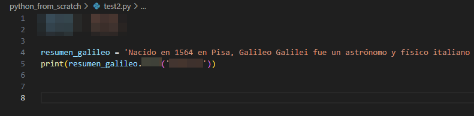

# Módulo 03. Tipos de datos. Cadenas de texto

## ❓ ¿Qué tipos de datos podemos tratar en Python?

Los tipos de datos nos ayudarán a conocer algo mejor la información que queremos tratar en nuestros programas. Empecemos entonces con una simple clasificación:

  * De Texto
    * 1️⃣ Cadenas de texto 👉 _(str)_
  * Datos Numéricos
    * 2️⃣ Números enteros 👉 _(int)_
    * 3️⃣ Números reales (o de "coma flotante") 👉 _(float)_
    * 4️⃣ Números complejos 👉 _(complex)_
  * Datos Booleanos 
    * 5️⃣ Bool 👉 _(bool)_
  * Secuencias
    * 6️⃣ Listas 👉 _(list)_
    * 7️⃣ Tuplas 👉 _(tuple)_
    * 8️⃣ Diccionarios 👉 _(dict)_
  
## 1️⃣ Cadenas de texto _(str)_

Aunque deberían ir englobadas dentro de la categoría de _secuencias_ (son también colecciones ordenadas de datos), debido a su relevancia dentro de la programación, a las cadenas de texto les vamos a dedicar una unidad completa.  
A lo largo de los módulos anteriores hemos hablado largo y tendido sobre las cadenas de texto (recuerda que son conjuntos de caracteres de cualquier tipo). Su abreviatura es _(str)_ del inglés _string_. No olvides que para escribir texto deberás hacerlo siempre utilizando comillas simples o dobles.  

Ejemplo de cadena de texto _(str)_: 'Manuel de Falla fue un gran compositor.'  

## ➕ Ampliación de conocimientos

👉 Python, en su instalación por defecto, pone a disposición del usuario muchas [funciones integradas](https://www-w3schools-com.translate.goog/python/python_ref_functions.asp?_x_tr_sl=auto&_x_tr_tl=es&_x_tr_hl=es) de las cuales no nos tendremos que preocupar (no hay que instalar ni configuar nada) y nos servirán para trabajar de manera cómoda con cadenas de texto y otros tipos de datos. Por ejemplo, si queremos saber la longitud de una cadena, será tan sencillo como añadirle `len()` para que nos muestre en pantalla cuántas letras componen nuestro _string_.

````Python
print(len('En un lugar de la Mancha, de cuyo nombre no quiero acordarme...'))
````

Resultado: ¡Cuidado! Los espacios en blanco cuentan también como elementos de la cadena.
> 63

👉 Otra función que puede resultarte interesante es `split()` que se encarga de separar una cadena de texto a partir de un carácter determinado, por ejemplo, una coma.

````Python
print('sumas,restas,multiplicaciones,divisiones'.split(','))
````

Resultado:
> ['sumas', 'restas', 'multiplicaciones', 'divisiones']

👉 Una de las más utilizadas es `replace(a, b)` que lo que nos permitirá es cambiar partes de una cadena de texto:

````Python
print('Manuel'.replace('uel', 'olo'))
````

Resultado: Cambiamos Manuel por Manolo.
> Manolo  

👉 Otra función más para pasar textos completamente a minúsculas o mayúsculas `lower()` o `upper()`:

````Python
print('LEONARDO DA VINCI'.lower())
````

Resultado: Pasamos texto a minúsculas.
> leonardo da vinci

👉 Y otra más... Esta nos servirá para buscar en la cadena de texto: `find()`:

````Python
print('En un largo texto indica la posición de mi nombre Miquel'.find('Miquel'))
````

Resultado: la palabra "Miquel" se encuentra en la posición 50.  
> 50

👉 Venga, va... ahora sí, la última, con `str[inicio:fin]` vamos a cortar partes de un texto creando una subcadena (recuerda que la posición del primer elemento es la "0"):

````Python
print('Me encantas, Pyhton'[13:19])
````

Resultado:
> Python

👉 Si quieres practicar con más funciones, puedes encontrar más información en <a href="https://www.w3schools.com/python/python_strings.asp">_Python Strings_. W3 Schools.</a>

---
### 👌 MD03 Actividad 01 (opcional)

Haz clic en el archivo __"main.py"__ que encontrarás en la parte superior de este módulo y <ins>adivina en qué posición se encuentra la palabra _Galileo_</ins>. Si revisas la información anterior de este módulo, no te será nada complicado hacerlo.  

<ins>Texto a copiar</ins>  
_Nacido en 1564 en Pisa, Galileo Galilei fue un astrónomo y físico italiano cuyas contribuciones revolucionaron la ciencia. Su telescopio permitió observaciones que desafiaron las creencias establecidas, confirmando el modelo heliocéntrico de Copérnico. Sin embargo, sus descubrimientos le valieron conflictos con la Iglesia Católica, que lo consideró hereje. A pesar de su persecución, persistió en sus investigaciones y sentó las bases de la física moderna, dejando un legado duradero en el avance científico._  
Ejemplo:  

  
Imagen: Pista para la resolución de la actividad opcional MD03 Actividad 01. 

---
### 🔴 MD03 Actividad 02

¿Cuántas veces habéis llenado hojas de vuestro cuaderno marcando las veces que se repite vuestro profe? ¡No os avergoncéis, lo hemos hecho todos! 😊  
Haz clic en el archivo __"main.py"__ 👆 y engancha el texto siguiente dentro de una variable llamada "historia". Luego, utilizando la función `count()` <ins>encuentra el número de veces que tu profe ha repetido la palabra "fijaos"</ins> que será almacenada en una segunda variable llamada "repeticion". Finalmente, deberá salir en pantalla un texto anunciando cuantas veces se ha repetido el término: "La palabra... se ha repetido...veces"

<ins>Texto a copiar</ins>  
_Hoy les contaré una emocionante historia sobre la antigua civilización de los egipcios. Fijaos bien, porque este relato está lleno de misterio y aventuras. Hace miles de años, en tierras lejanas del valle del Nilo, los egipcios construyeron grandes pirámides para honrar a sus faraones. Fijaos en esas enormes estructuras que desafiaban el tiempo, ¡eran impresionantes! En el antiguo Egipto, el río Nilo era fundamental para la vida de su pueblo. Fijaos cómo las aguas del Nilo inundaban las tierras y dejaban un fértil limo que permitía cultivar sus alimentos. Gracias a ello, los egipcios prosperaban. Una de las cosas más asombrosas de los egipcios era su escritura jeroglífica. Fijaos en esos símbolos que representaban objetos y sonidos. A través de ellos, los egipcios dejaron registrada su historia y conocimiento. Además, fijaos en las momias, que eran cuerpos preservados mediante un proceso especial. Los egipcios creían en la vida después de la muerte y preparaban a sus difuntos para esa nueva etapa. La vida en el antiguo Egipto también estaba llena de dioses y diosas. Fijaos en Ra, el poderoso dios del sol, y en Isis, la diosa protectora. Los egipcios les rendían culto y les pedían su protección. ¡Qué interesante es la historia de los egipcios! Fijaos en cómo su legado ha perdurado a lo largo de los siglos. Hoy podemos aprender sobre su cultura y admirar las maravillas que dejaron atrás. Espero que hayáis disfrutado de esta historia llena de misterios y curiosidades. Fijaos en los detalles y seguid explorando el fascinante mundo de la historia. ¡Hasta la próxima aventura!_  

Texto: Generado a través de IA en https://chat.openai.com para la actividad MD03 Actividad 02.

---
### 🔴 MD03 Actividad 03

Después de llevar a cabo el ejercicio anterior, es normal que te haya dado de resultado "1", ya que le hemos dicho al programa que el término exacto que debe buscar es "fijaos" y otras variantes como "Fijaos" con la primera "F" mayúscula, no las tiene en cuenta.  
Revisa la información anterior y mira a ver si con `upper` o `lower` podrías poner remedio al problema.  

En el archivo __"main.py"__ corrige tu programación hasta que te dé 8 (que es la cantidad real de veces que se repite la palabra).

---

# 🤗 Resumen del Módulo 3

Hasta aquí la tercera lección con aspectos básicos sobre Python. Recuerda que deberías retener los siguientes conceptos:

1. Tipos de datos.
2. Cadenas de texto.
3. _Strings_.
  
También que:  

* En Python las secuencias o cadenas de texto tienen gran cantidad de funciones asociadas que te facilitarán el trabajo. Algunas de ellas son:
  * Medir: `len` 👉 print(len('La cadena de texto a medir'))
  * Buscar: `find` 👉 print('Posición de la palabra a buscar'.find('palabra'))
  * Separar: `split` 👉 print('elemento1,elemento2,elemento3'.split(','))
  * Reemplazar: `replace` 👉 print('abuelo'.replace('o', 'a'))
  * Extraer: 👉 print('Palabra clave a extraer'[8:13])
  * Cambiar a mayúsculas/minúsculas: `upper` `lower` 👉 print('EN MINÚSCULAS'.lower())
  * Contar: `count` 👉 print('Hola,Hola,Hola'.count('Hola')) Testing!
