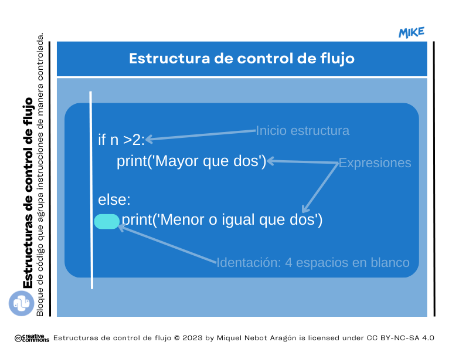

# Módulo 04. Tipos de datos. Datos numéricos

## ❓ ¿Qué tipos de datos podemos tratar en Python?
Los tipos de datos nos ayudarán a conocer algo mejor la información que queremos tratar en nuestros programas. Empecemos entonces con una simple clasificación:
  * De Texto
    * 1️⃣ Cadenas de texto 👉 _(str)_
  * Datos Numéricos
    * 2️⃣ Números enteros 👉 _(int)_
    * 3️⃣ Números reales (o de "coma flotante") 👉 _(float)_
    * 4️⃣ Números complejos 👉 _(complex)_
  * Datos Booleanos 
    * 5️⃣ Bool 👉 _(bool)_
  * Secuencias
    * 6️⃣ Listas 👉 _(list)_
    * 7️⃣ Tuplas 👉 _(tuple)_
    * 8️⃣ Diccionarios 👉 _(dict)_
  
## 2️⃣ Números enteros _(int)_
Los números enteros cuya abreviatura es _(int)_ son aquellos que utilizamos para llevar a cabo operaciones básicas como por ejemplo sumas, restas, multiplicaciones o divisiones. __No__ podemos utilizar este tipo de dato para representar decimales, fracciones o cualquier número que tenga una parte decimal.

Ejemplo de número entero _(int)_: 1, 2, -3, 123, -1435...

Ejemplo 1: realizamos suma de dos números enteros.
````Python
# Variables
a = 1234
b = 23

#Ejecución
print(a + b)
````
Resultado:
> 1257

❗ Hay que tener en cuenta que, aunque sean dos números enteros, al aplicarle una operación aritmética como puede ser una división, el resultado pase a ser un número con parte decimal.

Ejemplo 2: dividimos 25 entre 2.
````Python
# Variables
x = 25
y = 2

# Ejecución
print(x/y)
````
Resultado:
> 12.5

---
### 🔴 MD04 Actividad 01
En el documento, _main.py_ ☝, <ins>construye una calculadora simple para realizar sumas</ins>. Deberás crear un sistema para que el usuario introduzca el primer número, luego el segundo y, finalmente, arroje automáticamente el resultado de la suma. Recuerda lo que vimos con _input()_ en módulos anteriores.

Ejemplo:
````Python
# Variables
numero1 = input('Introduce el primer número: '))
numero2 = ...

# Ejecución
print('El resultado de la suma es:',...)
````
❗ Si sigues al milímetro el ejemplo, te habrás dado cuenta de que tu calculadora no funciona 😥. ¡Es del todo normal! Fíjate que en ningún momento le hemos dicho al programa que los datos introducidos por el usuario son números. En consecuencia, si tecleamos, por ejemplo, 10 y 20, el resultado nos dará 1020 (ha juntado las dos cadenas de texto que le hemos introducido y... ¡lo hace bien!).  
Prueba a corregir tu código diciéndole a las variables que son números enteros _(int)_, verás como cambia la cosa.  

````Python
# Variables
numero1 = int(input('Introduce el primer sumando: '))
...
````

---
## 3️⃣ Números reales o de coma flotante _(float)_
Son aquellos que representan números con decimales, es decir, números que tienen una parte entera y una parte decimal. El símbolo separador de ambas partes debe ser siempre un punto ".". En operaciones donde se utilicen estos tipos de números, los decimales proporcionados serán como máximo 15 dígitos.

Ejemplo de número real _(float)_: 1.2, 2.7, 3.34, -7.32, 1435.55...

```Python
a = 3.2
b = 7
print(a*b)
```
Resultado:
> 22.400000000000002

❗ En operaciones con este tipo de números son frecuentes los errores de redondeo. Aunque veamos en pantalla 3.2, este valor no se puede codificar de manera exacta en código binario. Lo que Python lee es el siguiente valor 3.2000000000000002 de ahí el resultado obtenido anteriormente. 

## 4️⃣ Números complejos _(complex)_
En Python son aquellos que representan números con una parte real y otra imaginaria. Por ejemplo, de la siguiente manera podríamos calcular el valor absoluto del número complejo "2+3j" ("j" sirve para representar la parte imaginaria en Python).
````Python
print(abs(2+3j))
````
Resultado:  
> 3.605551275463989

🤯 Siendo este un concepto bastante avanzado (y "complejo" 😉) para nuestros retos de iniciación, no profundizaremos más en el tema.

## ❓ Operaciones aritméticas en Python
Una vez repasados los tipos de datos numéricos a tratar, ¿qué te parece si descubrimos las operaciones que podemos hacer en Python?   

  
Imagen: Operadores aritméticos en Python.

Ejemplo 1: suma de dos números.
````Python
# Variables
n1 = 100
n2 = 200
# Ejecución
print(n1,'+',n2,'=',n1+n2)
````
Resultado:
> 100 + 200 = 300

Ejemplo 2: resta de dos números.  
````Python
# Variables
n1 = 112
n2 = 9
# Ejecución
print(n1,'-',n2,'=',n1-n2)
````
Resultado:
> 112 - 9 = 103

Ejemplo 3: multiplicación de dos números.  
````Python
# Variables
n1 = 9
n2 = 9
# Ejecución
print(n1,'x',n2,'=',n1*n2)
````
Resultado:
> 9 x 9 = 81

Ejemplo 4: división de dos números.  
````Python
# Variables
n1 = 10
n2 = 3
# Ejecución
print(n1,'/',n2,'=',n1/n2)
````
Resultado:
> 10 / 3 = 3.3333333333333335

Ejemplo 5: residuo de una división entre dos números.  
````Python
# Variables
n1 = 10
n2 = 3
# Ejecución
print(n1,'/',n2,'Residuo =',n1%n2)
````
Resultado:
> 10 / 3 Residuo = 1

Ejemplo 6: cociente de una división entre dos números.  
````Python
# Variables
n1 = 10
n2 = 3
# Ejecución
print(n1,'/',n2,'Cociente =',n1//n2)
````
Resultado:
> 10 / 3 Cociente = 3

## ➕ Ampliación de conocimientos 

Antes de poder continuar con esta segunda actividad del módulo deberemos entender cuáles son los agrupamientos de instrucciones (estructuras de control de flujo) que te van a permitir bifurcaciones (diferentes caminos) en Python. Por ello, empecemos viendo algunas estructuras condicionales:  
  
Imagen: Esquema de estructuras de control de flujo.  

👉 La sentencia _(if)_  
Te va a permitir generar un bloque de código que se ejecutará si <ins>se cumple una condición inicial</ins>.

Ejemplo: en este primer ejemplo vemos como, si se cumple la condición de que el primer número sea mayor, se ejecutará la instrucción _(print)_ dando un mensaje.  
```Python
# Variables
n1 = 102
n2 = 100

# Ejecución
if n1>n2:
  print('El primer número es mayor.')
```

Resultado:
> El primer número es mayor.

👉 La sentencia _(else)_   
Opcionalmente y acompañando a la sentencia _(if)_ (o a la que veremos a continuación _(elif)_) puedes agregar una respuesta _(else)_ que se ejecutará si la condición inicial no se cumple, es decir, es _FALSE_.  

Ejemplo: veamos como completar el ejemplo anterior.
 
```Python
# Variables
n1 = 99
n2 = 100

# Ejecución
if n1>n2:
  print('El primer número es mayor.')
else:
  print('El primer número NO es mayor.')
```
Resultado: 
> El primer número NO es mayor.

👉 La sentencia _(elif)_  
Se pueden incluir diversas condiciones a verificar después de la primera condición _(if)_.

Ejemplo: veamos cómo cuenta las letras de un nombre y arroja un resultado teniendo en cuenta diversas condiciones.  

```Python
# Variables
nombre = 'Manuel'

# Ejecución
if len(nombre) == 7:
  print('Tiene SIETE letras.') # Esta sentencia no se ejecutará ya que es FALSE.
elif len(nombre) < 7:
  print('Tiene MENOS DE SIETE letras.') # Esta sentencia sí que se ejecutará ya que es TRUE.
else:
  print('Tiene MÁS DE SIETE letras.')
```

Resultado:
> Tiene MENOS DE SIETE letras.

  
Imagen: Ejemplo de sentencias condicionales. _if_, _elif_ y _else_.  

---
### 🔴 MD04 Actividad 02
En esta segunda actividad obligatoria del módulo desarrollaremos <ins>una máquina que sea capaz de comparar cadenas de texto</ins>.   

Crea un nuevo documento de nombre _(main2.py)_ tal y como te mostramos en la siguiente captura e intenta desarrollar la máquina que te planteamos teniendo en cuenta los ejemplos anteriores: 

  
Imagen: Añadir nuevo archivo de Python · <a href="https://replit.com">Replit</a>

---
## ➕ Ampliación de conocimientos
👉 Los bucles _(while)_ 

Antes de finalizar este cuarto módulo y, para que intentes llevar a cabo la última actividad voluntaria (👌 MD04 Actividad 03 👇), nos familiarizaremos con las estructuras de programación conocidas como __bucles__ _(while)_ (en castellano lo podríamos traducir por "mientras").  

Utilizamos los bucles para repetir una secuencia de instrucciones o sentencias (cada una de las repeticiones se llama _iteración_) un número indefinido de veces. Este ciclo se repetirá siempre que la condición dada sea verdadera _(TRUE)_ y solo parará si es falsa _(FALSE)_.  

  
Imagen: Estructura básica de un bucle en Python.

Ejemplo 1: establecemos el valor 1 a una única variable (de nombre "numero") que tenemos en nuestro programa. A continuación le decimos que, hasta que sea inferior a 10 vaya imprimiendo en pantalla la variable. Al mismo tiempo con _(numero = numero + 1)_ vamos incrementando el valor de la variable. Como es de esperar, al llegar al valor 9 se detendrá el bucle y pasará a la siguiente instrucción. Lo vemos fácilmente en el código del ejemplo 👇.

````Python
# Variables
numero = 1

# Ejecución
while numero < 10:
  print(numero)
  numero = numero + 1
print ('Bucle finalizado')

````
Resultado:
>1\
>2\
>3\
>4\
>5\
>6\
>7\
>8\
>9\
>Bucle finalizado

Ejemplo 2: veamos un segundo ejemplo donde establecemos la condición de que tendrá que seguir ejecutando las instrucciones de manera repetitiva (iteración) hasta que el número resultante sea inferior o igual a 100.

````Python
# Variables
numero = 10

# Ejecución
while numero <= 100:
  print(numero)
  numero = numero * 2
print ('¡Hemos llegado al final!')

````
Resultado:
>10\
>20\
>40\
>80\
>¡Hemos llegado al final!

❗Nota! Hay que tener en cuenta que este bucle se detiene en 80, ya que si le aplicamos el doble superaría con creces (160) el límite establecido de 100 en la condición.

Ejemplo 3: veamos un último ejemplo donde establecemos la condición de que el usuario tiene que introducir un valor en forma de número entero positivo. 

````Python
# Variables
numero = int(input('Escribe un número positivo: '))

# Ejecución
while numero < 0:
  print('El número introducido no es válido.')
  numero = int(input('Inténtalo de nuevo introduciendo, ahora sí, un número positivo: '))
print ('¡Gracias por tu colaboración!')

````
Resultado:
>-7\
>El número introducido no es válido.\
>Inténtalo de nuevo introduciendo, ahora sí, un número positivo:\
>3\
>¡Gracias por tu colaboración!

---
### 👌 MD04 Actividad 03 (opcional)
Para finalizar, <ins>¿te animas a programar una auténtica calculadora?</ins> Presta mucha atención porque tendremos que utilizar los nuevos conceptos estudiados anteriormente. De todos modos, no te preocupes, ya que esta es una actividad guiada por completo, es decir, podrás ir copiando el código en tu archivo de Python e ir personalizándolo a tu gusto.

```Python
numero1 = float(input("Introduce ahora tu primer número: ") )
numero2 = float(input("Introduce a continuación tu segundo número: ") )

while True:
    print("""
    ¿Qué tipo de operación deseas realizar ahora?
    
    1) Sumar
    2) Restar
    3) Multiplicar
    4) Dividir
    5) Introducir nuevos valores
    6) Salir
    """)
    opcion = int(input("Elige una opción: ") )     

    if opcion == 1:
        print('')
        print('RESULTADO: La suma de',numero1,'+',numero2,'es',numero1+numero2)
    elif opcion == 2:
        print('')
        print('RESULTADO: La resta de',numero1,'-',numero2,'es',numero1-numero2)
    elif opcion == 3:
        print('')
        print('RESULTADO: El producto de',numero1,'x',numero2,'es',numero1*numero2)
    elif opcion == 4:
        print('')
        print('RESULTADO: El cociente entre',numero1,'/',numero2,'es',numero1/numero2)
    elif opcion == 5:
        numero1 = float(input('Introduce ahora tu primer número: ') )
        numero2 = float(input('Introduce ahora tu segundo número: ') )
    elif opcion == 6:
        break
    else:
        print("¡Opción incorrecta!")

```  
Resultado:
>Introduce ahora tu primer número: 7\
>Introduce a continuación tu segundo número:  3\
>¿Qué tipo de operación deseas realizar ahora?\
>1\) Sumar\
>2\) Restar\
>3\) Multiplicar\
>4\) Dividir\
>5\) Introducir nuevos valores\
>6\) Salir
>Elige una opción: 1\
>La suma de 7 + 3 es 10

---
# 🤗 Resumen del Módulo 4

Hasta aquí la cuarta lección con aspectos básicos sobre Python. Recuerda que deberías retener los siguientes conceptos:
1. Tipos de datos numéricos.
2. Números enteros _(int)_, reales o de coma flotante _(float)_ y complejos _(complex)_.
3. Operadores aritméticos básicos: suma, resta, multiplicación, división, residuo y cociente.
  
También que:  
* En Python, al igual que en otros lenguajes de programación, existen una serie de sentencias que permiten "elegir" al programa el camino correcto a la hora de continuar.
  * _if_ 👉 Si se cumple la condición que se siga ejecutando la programación siguiendo el orden establecido.
  * _else_ 👉 Si la condición del _if_ no se cumple, automáticamente saltará a la instrucción que contenga esta sentencia.
  * _elif_ 👉 Es de gran utilidad para verificar diversas condiciones una detrás de la otra.
  * _while_ 👉 Para ejecutar bucles de repetición utilizaremos _while_ el cual estará en funcionamiento de manera indefinida o hasta que la respuesta a alguna consulta sea _FALSE_.
