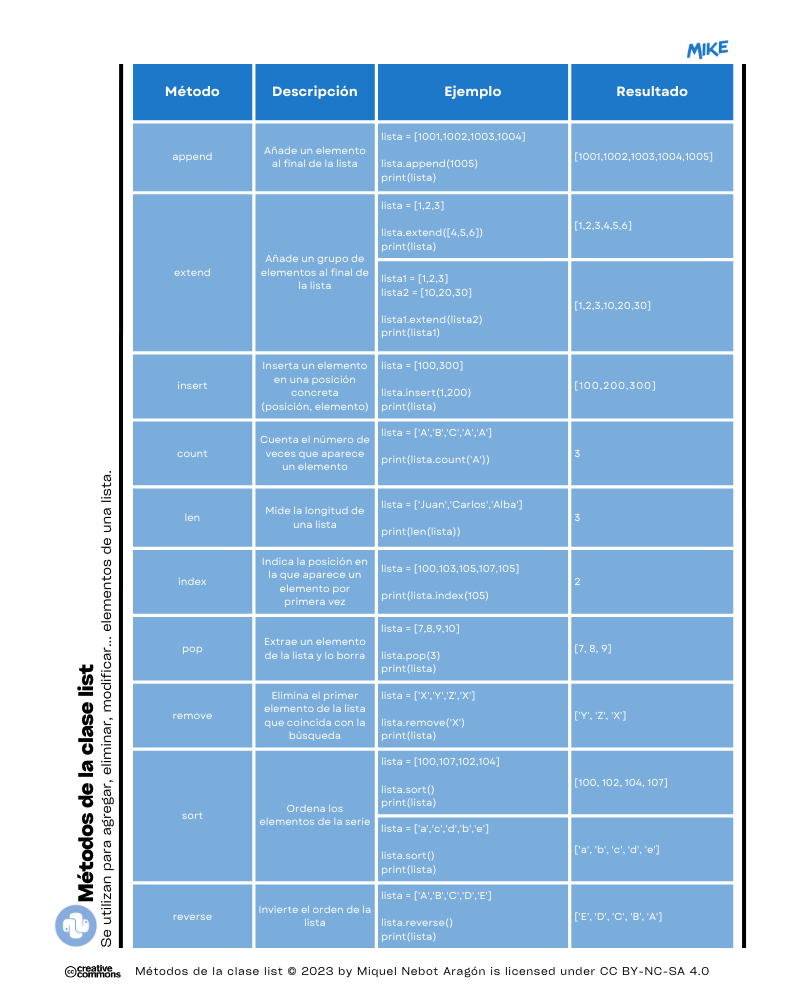

# Módulo 06. Secuencias. Listas

## ❓ ¿Qué tipos de datos podemos tratar en Python?
Los tipos de datos nos ayudarán a conocer algo mejor la información que queremos tratar en nuestros programas. Empecemos entonces con una simple clasificación:
  * De Texto
    * 1️⃣ Cadenas de texto 👉 _(str)_
  * Datos Numéricos
    * 2️⃣ Números enteros 👉 _(int)_
    * 3️⃣ Números reales (o de "coma flotante") 👉 _(float)_
    * 4️⃣ Números complejos 👉 _(complex)_
  * Datos Booleanos 
    * 5️⃣ Bool 👉 _(bool)_
  * Secuencias
    * 6️⃣ Listas 👉 _(list)_
    * 7️⃣ Tuplas 👉 _(tuple)_
    * 8️⃣ Diccionarios 👉 _(dict)_

### 6️⃣ Listas
Las listas en Python representan a un conjunto ordenado de valores que serán almacenadas en memoria como un único objeto para ser procesadas con posterioridad. Los elementos deberán ir entre corchetes "[ ]".   
❗ Una de las características importantes de las listas es que __su contenido puede ser modificado__ una vez que hayan sido creadas.

Ejemplos de listas: 
* lista1 = [1,2,3,4]
* lista2 = ['Juan','Marcos','Ángela']
* lista3 = [2,'z',[1006,1007]]

Ejemplo 1: extraemos el elemento número 2 (recordad que empezamos siempre en el "0") de la cadena.  

````Python
algunos_numeros_naturales = [101,102,103,104,105]
print(algunos_numeros_naturales[2])
````
Resultado:
> 103

## ➕ Ampliación de conocimientos
Veamos ahora algunos métodos a la hora de trabajar con listas.  

👉 Descubrir __qué tipos de variables__ contiene nuestra lista.  

Ejemplo 1: 
````Python
# Variables
lista_numeros = [1,2,3,4,5]
lista_mixta = ['Carlos','Alba',33,True]

# Ejecución
print(type(lista_numeros)) # Deberá indicar que es una lista.
print(type(lista_mixta[1])) # Deberá indicar que es una cadena de texto.
print(type(lista_mixta[2])) # Deberá indicar que es un número entero.
print(type(lista_mixta[3])) # Deberá indicar que es un booleano.
````
Resultado:
> <class 'list'>  
<class 'str'>  
<class 'int'>  
<class 'bool'>  

---
### 🔴 MD06 Actividad 01
#### <ins>Parte A</ins>
En el archivo main.py enumera un total de <ins>3 variables en forma de lista</ins> que tengan las características siguientes:  
* Una primera variable que contenga números enteros.
* Una segunda variable que contenga cadenas de texto.
* Una tercera variable que contenga tanto texto como números (pueden ser enteros o de coma flotante __float__)
#### <ins>Parte B</ins>
A continuación haz que el programa muestre en pantalla <ins>qué tipos de datos se encierran en las listas anteriores</ins>. Recuerda que deberás indicar siempre la posición de la cadena que quieres que sea analizada (posición entre corchetes "[ ]").

---
👉 __Extraer valores__ de una lista anidada.  

Ejemplo 1: sacamos todos los valores de la lista anidada.
````Python
# Variables
abecedario = ['a','b',['C','D'],'e','f']

# Ejecución
print(abecedario[2]) # Extraerá los valores de la lista anidada que se encuentra en la posición 2.
````
Resultado:
> ['C', 'D']

---
### 🔴 MD06 Actividad 02
Los números premiados de la lotería en los principales sorteos del pasado año han sido los siguientes:  
Enero > 17456  
Febrero > 23569  
Septiembre > 90869  
Octubre > 20013  
Noviembre > 99521    
Diciembre > 30007  
<ins>Construye una lista con todos los números, incluyendo una lista anidada</ins> en su interior con los números del sorteo de diciembre y enero que son los dos más importantes. Luego haz que el programa muestre en pantalla únicamente estos dos números. Fíjate en el ejemplo anterior para saber cómo hacerlo.  

---
Ejemplo 2: sacamos un único valor de una lista anidada.
````Python
# Variables
trabajadores = ['Manuel',['Carla','Sofía'],'Alberto','Álvaro']

# Ejecución
print(trabajadores[1][0]) # Extraerá el primer elemento de la lista embebida.
````
Resultado:
> Carla
---
### 🔴 MD06 Actividad 03
Utilizando los datos del ejercicio anterior, haz que el programa <ins>muestre en pantalla solo el valor del número premiado de Navidad</ins>, es decir, solo el número de diciembre.

---
👉 Acceder a __posiciones negativas__ de una lista anidada.   

Ejemplo: sacamos el último valor de una lista anidada.
````Python
# Variables
numeros = [1200,[2200,3200,4200],5200,6200]

# Ejecución
print(numeros[1][-1]) # Extraerá el último valor de la lista que está en la posición 1 de la lista.
````
Resultado:
> 4200


👉 Acceder a una __posición concreta__ en una cadena de texto.   

Ejemplo: sacamos la letra deseada de una cadena en concreto.
````Python
# Variables
arboles = ['naranjo','peral','manzano',['almendro','algarrobo']]

# Ejecución
print(arboles[1][2]) # Extraerá la letra "r" de la palabra "peral".
````
Resultado:
> r

## ➕➕ Ampliación de conocimientos  
Subimos algo más el listón y vamos con conceptos algo más avanzados.

👉 Recorrer los elementos de una lista con _for_.
Seguirá la estructura siguiente:
```Python
for <elemento> in <lista>:
  <nuestro código>
```
Siendo __elemento__ la variable que toma el valor del objeto dentro de la lista.

Ejemplo: veremos en pantalla los elementos separados de una lista.
```Python
# Variables
lista = ['Juan','Carlos','Alba']

# Ejecución
for n in lista:
    print(n)
```
Resultado:
> Juan  
Carlos  
Alba  

---
### 🔴 MD06 Actividad 04
<ins>Construye aquí una nueva lista con los componentes de un equipo ficticio mixto de trabajo</ins> para desarrollar un trabajo de clase. Consigue que el programa liste el nombre de los componentes de dicho grupo como ves en el ejemplo:  
> Ana  
> Pablo  
> Sonia  
> Abel

---

👉 Añadir elementos a una lista con _append_.  

Ejemplo 1:  
````Python
# Variables
frutas_verano = ['melón','sandía']

# Ejecución
print(frutas_verano) # Aquí sacará en pantalla solo los dos valores existentes
frutas_verano.append('nectarina') # De esta manera añadimos "nectarina" a nuestra lista.
print(frutas_verano)
````
Resultado:
> ['melón', 'sandía']  
['melón', 'sandía', 'nectarina']

---
### 🔴 MD06 Actividad 05
Finalmente, a vuestro grupo de trabajo se ha añadido una última persona, Mónica. <ins>Añádela mediante la opción _append_ a la lista anterior</ins>.  

---

Ejemplo 2: añadimos elementos a una lista anidada.  

````Python
# Variables
lista_numerada = [1,2,3,[100,200]]

# Ejecución
print(lista_numerada[3]) # Aquí sacará en pantalla, por ejemplo, solo los dos valores de la lista anidada.
lista_numerada[3].append(300) # De esta manera añadimos el número "300" a nuestra lista.
print(lista_numerada)
````
Resultado:
> [100, 200]  
[1, 2, 3, [100, 200, 300]]

👉 Ordenar elementos de una lista con _sorted_.  

Ejemplo 1: ordenar una lista desordenada de números y mostrarla en pantalla.  

````Python
# Variables
lista_desordenada = [1,200,33,2,4]

# Ejecución
print(sorted(lista_numerada))
````
Resultado:
> [1, 2, 4, 33, 200]

Ejemplo 2: podemos ordenar también alfabéticamente una lista de nombres.  
````Python
# Variables
a = ['Antonio','Carlos','Bea']

# Ejecución
print(sorted(a))
````
Resultado:  
> ['Antonio', 'Bea', 'Carlos']

---
### 🔴 MD06 Actividad 06
Intenta en esta actividad que el programa <ins>ordene alfabéticamente los nombres de los componentes de tu grupo de trabajo</ins>. Recuerda que deberás utilizar la opción _sort_. 

---
👉 Eliminar elementos de una lista con _del_.  

Ejemplo:
````Python
# Variables
b = ['lápices','gomas','bolígrafos','cuadernos']

# Ejecución
del b[3] # De esta forma eliminamos de manera permanente 'cuadernos' de la lista.
print(b)
````
Resultado:
> ['lápices', 'gomas', 'bolígrafos']

👉 Invertir el orden de una lista con _reverse_.

Ejemplo: 
````Python
# Variables
lista = [1001,1002,1003,1004]

# Ejecución
lista.reverse()
print(lista)
````
Resultado:
> [1004, 1003, 1002, 1001]

En forma de esquema, estos y otros métodos de las listas en Python 👇️

  
Imagen: Métodos de la clase _list_.

---
### 👌 MD06 Actividad 07 (opcional)
A través de esta actividad guiada, construye un programa que pida al usuario la introducción de números que serán almacenados en una lista. El programa finalizará al introducir el número "0". Finalmente y después de introducir el valor de _parada_, "0", que nos aparezca en pantalla el listado ordenado de los números introducidos.  

Fíjate cómo hacerlo y personalízalo a tu gusto:
````Python
# Variables
lista_numeros = [] 
acabar = False

# Ejecución
while(not acabar):
    numero = int(input("Introduce un número (0 para acabar): "))
    if(numero == 0):
        acabar=True
    else:
        lista_numeros.append(numero)
 
lista_numeros.sort() 
print(lista_numeros)
````

---

# 🤗 Resumen del Módulo 6

Hasta aquí la sexta lección con aspectos básicos sobre Python. Recuerda que deberías retener los siguientes conceptos:
1. Tipos de datos.
2. Tipos de secuencias: listas.
3. _list_.
4. Métodos de la clase _list_.
5. _for_ y _in_ para recorrer los componentes de una lista.
  
También que:  
* Los métodos más utilizados para trabajar con listas son:
  * Añadir: _append_ 👉️ lista.append(1050)
  * Extender: _extend_ 👉️ lista.extend([40,50,60])
  * Insertar (posición,valor): _insert_ 👉️ lista.insert(0,153)
  * Contar: _count_ 👉️ print(lista.count('Premio'))
  * Longitud: _len_ 👉️ print(len(lista))
  * Índice (indicar posición de un valor): _index_ 👉️ print(lista.index('Manuel'))
  * Extraer y borrar: _pop_ 👉️ lista.pop(2)
  * Eliminar valor: _remove_ 👉️ lista.remove('Santander')
  * Ordenar: _sort_ 👉️ lista.sort()
  * Invertir orden: _reverse_ lista.reverse()
