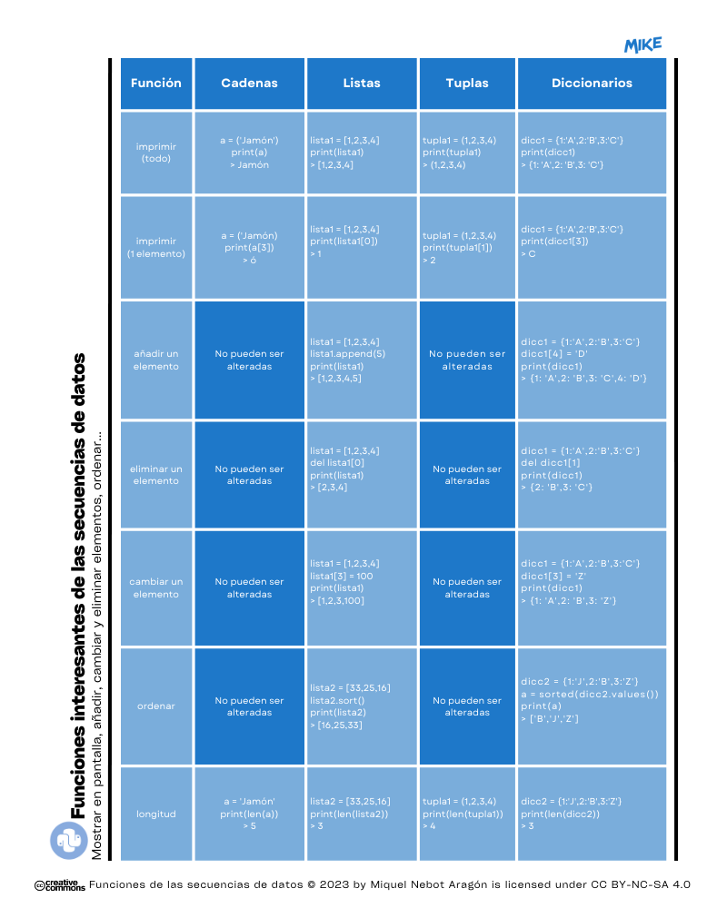
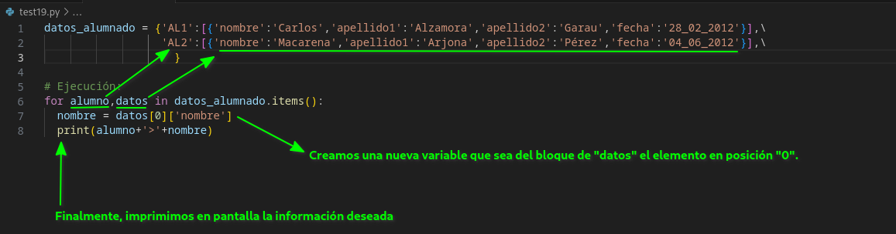

# Módulo 08. Secuencias. Diccionarios

## ❓ ¿Qué tipos de datos podemos tratar en Python?
Los tipos de datos nos ayudarán a conocer algo mejor la información que queremos tratar en nuestros programas. Empecemos entonces con una simple clasificación:
  * De Texto
    * 1️⃣ Cadenas de texto 👉 _(str)_
  * Datos Numéricos
    * 2️⃣ Números enteros 👉 _(int)_
    * 3️⃣ Números reales (o de "coma flotante") 👉 _(float)_
    * 4️⃣ Números complejos 👉 _(complex)_
  * Datos Booleanos 
    * 5️⃣ Bool 👉 _(bool)_
  * Secuencias
    * 6️⃣ Listas 👉 _(list)_
    * 7️⃣ Tuplas 👉 _(tuple)_
    * 8️⃣ Diccionarios 👉 _(dict)_

### 8️⃣ Diccionarios
Los diccionarios son estructuras de datos que se van almacenando en pares siguiendo la estructura siguiente: _clave:valor_. Deberán ir entre corchetes "{ }" y separados sus pares por comas ",". Veamos un ejemplo para comprender mejor.  

Ejemplo de diccionario: {'localidad':'Son Servera','codigo_postal':'07550'}

Ejemplo 1: con _print()_ mostraremos todos los valores que componen nuestro diccionario.
```Python
# Variables
primera_participante = {'nombre':'Regina','apellido1':'Santorini','apellido2':'de la Cierva'}

# Ejecución
print(primera_participante)
```
Resultado:
> {'nombre': 'Regina', 'apellido1': 'Santorini', 'apellido2': 'de la Cierva'}

Ejemplo 2: continuando con el ejemplo anterior, extraemos un único valor de nuestro diccionario, por ejemplo, sacaremos el primer apellido de la participante.

```Python
# Variables
primera_participante = {'nombre':'Regina','apellido1':'Santorini','apellido2':'de la Cierva'}

# Ejecución
print(primera_participante['apellido1'])
```
Resultado:
> Santorini

Ejemplo 3: extraeremos todos los valores almacenados en nuestro diccionario de la manera siguiente.
```Python
# Variables
primera_participante = {'nombre':'Regina','apellido1':'Santorini','apellido2':'de la Cierva'}

# Ejecución
for valor in primera_participante:
    print(primera_participante[valor])
````
Resultado:
> Regina  
> Santorini  
> de la Cierva

Ejemplo 4: añadiremos un nuevo campo al diccionario, por ejemplo nos puede interesar almacenar la localidad de la participante.
```Python
# Variables
primera_participante = {'nombre':'Regina','apellido1':'Santorini','apellido2':'de la Cierva'}
primera_participante['localidad'] = 'Cangas del Narcea'

# Ejecución
print(primera_participante) # Mostraremos así en pantalla el diccionario al completo.

for valor in primera_participante: # De esta manera, los valores por separado y en posición vertical.
  print(primera_participante[valor])
```
Resultado:
> {'nombre': 'Regina', 'apellido1': 'Santorini', 'apellido2': 'de la Cierva', 'localidad': 'Cangas del Narcea'}  
Regina  
Santorini  
de la Cierva  
Cangas del Narcea  

Ejemplo 5: con la función _del dicciontary[]_ eliminaremos el elemento deseado.
```Python
# Variables
primera_participante = {'nombre':'Regina','apellido1':'Santorini','apellido2':'de la Cierva'}
del primera_participante['nombre']

# Ejecución
print(primera_participante)
```
Resultado:
> {'apellido1': 'Santorini', 'apellido2': 'de la Cierva'}

Ejemplo 6: cambiamos un elemento por otro dado. 
```Python
# Variables
primera_participante = {'nombre':'Regina','apellido1':'Santorini','apellido2':'de la Cierva'}
primera_participante['nombre'] = 'María Angustias'

# Ejecución
for valor in primera_participante:
  print(primera_participante[valor])
```
Resultado:
> María Angustias   
Santorini   
de la Cierva   

Ejemplo 7: si es necesario, con la función _sorted()_ podremos ordenar los valores de un diccionario. Veamos un nuevo ejemplo.
```Python
# Variables
dicc1 = {1:'A',2:'B',3:'Z',4:'M'}
dicc1_ordenado = sorted(dicc1.values())

# Ejecución
print(dicc1)
print(dicc1_ordenado)
```
Resultado:
> {1: 'A', 2: 'B', 3: 'Z', 4: 'M'}  
['A', 'B', 'M', 'Z']  

En forma de esquema imprimible, funciones interesantes para las cadenas de texto y las secuencias de datos 👇️

  

Imagen: Funciones interesantes para las secuencias de datos.

---
### 🔴 MD08 Actividad 01
Continuando con el ejemplo anterior, construye a continuación un diccionario con los datos siguientes de 5 de tus compañeros/as de clase. Fíjate cómo se hace para anidar un diccionario dentro de otro.
* Número de lista
* Nombre
* Apellido 1
* Apellido 2
* Fecha de nacimiento
```Python
# Variables
# Construcción de nuestro primer diccionario:
datos_alumnado = {'AL1':[{'nombre':'Carlos','apellido1':'Alzamora','apellido2':'Garau','fecha':'28_02_2012'}],\
                  'AL2':[{'nombre':'Macarena','apellido1':'Arjona','apellido2':'Pérez','fecha':'04_06_2012'}],\
                  'AL3':[{}]}
```
---
## ➕ Ampliación de conocimientos 
Después de ver cómo construir un diccionario de una complejidad considerable como es el anterior, aprendamos de qué manera podemos imprimir por pantalla los resultados para que sean fácilmente legibles por parte del usuario.
  

Imagen: Cómo imprimir de manera selectiva la información de un diccionario.   

Resultado:
> AL1>Carlos  
AL2>Macarena  
---
### 👌 MD08 Actividad 02 (opcional)
A partir del diccionario anterior, haz que tu programa muestre en pantalla la información detallada de cada alumno/a. Podría tener el siguiente formato:
> AL1 > Carlos Alzamora Garau - 28_02_2012
---

# 🤗 Resumen del Módulo 8

Hasta aquí la octava lección con aspectos básicos sobre Python. Recuerda que deberías retener los siguientes conceptos:
1. Tipos de datos.
2. Tipos de secuencias: diccionarios.
3. Clave y valor.
4. Funciones destacadas para las secuencias de datos.
