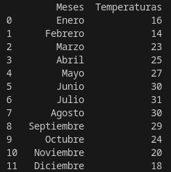
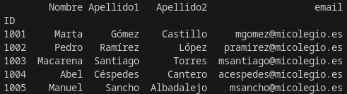
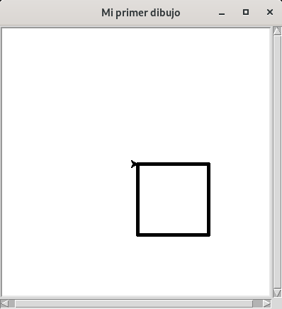

# Módulo 09. Librerías

## ❓ ¿Qué son las librerías? ¿Para qué sirven? ¿Cuántas hay?
De manera muy simple, podríamos definir las __librerías__ (también son conocidas como bibliotecas o módulos) como <ins>un conjunto de instrucciones que permiten extender las funcionalidades básicas del lenguaje</ins>, ayudándonos a ahorrar tiempo al no tener que picar todo el código desde cero.
A día de hoy se computan más de 130.000 librerías en Python que nos facilitan enormemente nuestro trabajo a la hora de programar. Veamos algunos ejemplos:

## ➕ Ampliación de conocimientos
Para poder utilizar las librerías o módulos, deberás utilizar un editor de código en local y tenerlas previamente instaladas en tu equipo. En el siguiente [vídeo](https://youtu.be/OrrESeNVJSc) te enseñamos cómo hacerlo, por ejemplo, en un Chromebook.
En ordenadores con sistema operativo Linux (prácticamente todas las distribuciones actuales llevan Python instalado por defecto) será extremadamente sencillo realizar este proceso.  

```console
// Conecta con Python 2 en Linux o Mac. También sirve para instalar paquetes de Python 3 en Windows.
pip install module_name

// Conecta con Python 3.
pip3 install module_name
```

❗️ Evitemos la elevación de permisos con _sudo_ en Linux. Aunque podemos confiar en la mayoría de librerías, debemos extremar las precauciones para no dejar una puerta abierta al malware.

---

### Time

Librería [time](https://docs.python.org/3/library/time.html). Empezamos con un ejemplo muy sencillo. Gracias a esta librería podremos (entre otras muchas funciones) detener por ejemplo la ejecución de nuestro programa, los segundos que le marquemos a esta función.  

Ejemplo:

```Python
# Librerías
import time

# Ejecución
nombre = (input('¿Serías tan amable de decirme tu nombre? '))

time.sleep(1)
print(f'\nBienvenido/a {nombre}, ¿qué tal te encuentras hoy?')
time.sleep(2)

quiere = int(input('\n¿Quieres saber cuántas letras tiene tu nombre? 1 para sí, 2 para no. '))

if quiere == 1:
    print(len(nombre))
    time.sleep('¡Gracias por utilizar el servicio!')
else:
    print('Gracias y que pases muy buen día.')
```
Resultado:
> ¿Serías tan amable de decirme tu nombre? Anacleto  
>
> Bienvenido/a Anacleto, ¿qué tal te encuentras hoy?  
>
> ¿Quieres saber cuántas letras tiene tu nombre? 1 para sí, 2 para no. 2  
> Gracias y que pases muy buen día.    

### Random
Librería [_random_](https://docs.python.org/es/3.10/library/random.html). Esta librería o módulo implementa generadores de números pseudoaleatorios (no siguen ningún patrón aunque son generados por un algoritmo determinista).

Ejemplo:  

```Python
# Librerías
import random

# Ejecución
for num in range(5):
    aleatorios = random.randint(0,100)
    print(aleatorios)
```
Resultado:
> 3  
34  
71  
92  
42  

---
### 👌 MD09 Actividad 01 (opcional)
Esta es una actividad guiada donde verás de primera mano cómo realizar un <ins>juego de prueba error utilizando la librería _random_</ins> en Python. Analiza, estudia y personaliza la programación a tu gusto para conseguir un programa lo más elaborado posible.
```Python
# Librerías
import random

# Variables
numero_aleatorio = random.randint(1, 100) # Generando un número aleatorio entre 1 y 100.
contador_usuario = 0

# Ejecución
while True: # El bucle estará en ejecución hasta que el usuario adivine el número aleatorio.
    numero_usuario = int(input('Introduce un número entre 1 y 100: '))
    if numero_usuario == numero_aleatorio:
        print(f'Has adivinado el número en {contador_usuario} intentos.')
        break
    elif numero_usuario < numero_aleatorio:
        print('El número que has elegido es bajo...')
    elif numero_usuario > numero_aleatorio:
        print('El número que has elegido es alto...')

    contador_usuario += 1 # Cada vez que el bucle se repita, se incrementará el contador de intentos.
  ```

---
### Pandas
Librería [_pandas_](https://pandas.pydata.org/). Es una de las librerías "estrella" que encontrarás en prácticamente todos los programas desarrollados en Python, donde se manejen y analicen estructuras de datos.

Ejemplo 1: En este primer ejemplo construiremos un diccionario con datos para realizar una tabla de temperaturas medias anuales de una localidad del Mediterráneo.

```Python
# Librerías
import pandas as pd

# Ejecución
datos = {'Meses':['Enero','Febrero','Marzo','Abril','Mayo','Junio','Julio','Agosto','Septiembre','Octubre','Noviembre','Diciembre'],\
         'Temperaturas':[16,14,23,25,27,30,31,30,29,24,20,18]}

climograma = pd.DataFrame(datos)
print(climograma)
```
Resultado:  


Ejemplo 2: Avanzamos algo más en este segundo ejemplo donde trataremos de que la librería lea los datos incluidos en un archivo CSV (archivo de texto plano con los valores separados por comas "," o punto y coma ";") con información de alumnos para finalmente generar un _dataframe_ (tabla) con dicha información.  

📝 [grupo1.csv](md09_librerias_assets/grupo1.csv)

```Python
# Librerías
import pandas as pd

# Ejecución
grupo1 = pd.read_csv('grupo1.csv', sep=';',index_col=0)

print(grupo1)
```
Resultado:  


---
### 🔴 MD09 Actividad 02
Después de analizar los dos ejemplos anteriores, <ins>crea un diccionario ficticio con gastos e ingresos</ins> de una supuesta venta de camisetas, bocadillos... que llevaríais a cabo para sufragar los gastos de vuestro viaje de estudios. A continuación, mediante la librería _pandas_ muestra en pantalla el resultado obtenido.

---

### Turtle
Librería [turtle](https://docs.python.org/es/3.9/library/turtle.html). Finalizamos esta serie de ejemplos con una librería que despertará tu lado más creativo. ¿Cuántas veces has utilizado la herramienta [lápiz](https://scratch.mit.edu/search/projects?q=pencil) en Scratch? Muchas, ¿verdad? ¡Pues esto es exactamente lo mismo elevado al máximo exponente! Empezaremos con un cuadro muy sencillo para ver cómo funciona.

```Python
# Importamos las librerías necesarias
from turtle import Screen, Turtle

# Invocamos y configuramos inicialmente el escenario
escenario = Screen() # Creamos el escenario donde poder pintar.
escenario.title('Mi primer dibujo') # Le damos un nombre a la ventana creada.
escenario.setup(400, 400) # Indicamos de qué tamaño lo queremos.

# Definimos la herramienta "Turtle" que se encargará de pintar el dibujo
dibujo = Turtle()
dibujo.width(5) # Tamaño del trazo.
dibujo.speed(2) # Velocidad.

# Si queremos crear un cuadro las instrucciones necesarias serán las siguientes:
for i in range(4):
    dibujo.forward(100)
    dibujo.right(90)

# Con estas, por ejemplo obtendremos un octógono:
#for i in range(8):
#    dibujo.forward(30)
#    dibujo.right(45) 

# Y una más... con estas una circunferencia:
#radio = 50
#dibujo.circle(radio)

escenario.exitonclick()
```
---
Resultado:  


---
### 🔴 MD09 Actividad 03
Utilizando la librería _"turtle"_, documéntate en la red, busca ejemplos y da rienda suelta a tu imaginación... ¡Crea la figura que más te guste!
___

### 👌 MD09 Actividad 04
Veamos ahora todo el potencial de _"turtle"_ en este ejemplo 100 % guiado. ¿Te animas a construir una figura repleta de color? ¡Fíjate que es sencillísimo!
```Python
# Importamos las librerías necesarias
from turtle import Screen, Turtle

# Invocamos y configuramos inicialmente el escenario
escenario = Screen() # Creamos el escenario donde poder pintar.
escenario.bgcolor('black') # En esta ocasión nuestro escenario será negro.
escenario.title('Figura de color') # Le damos un nombre a la ventana creada.
escenario.setup(400, 400) # Indicamos de qué tamaño lo queremos.

# Definimos la herramienta "Turtle" que se encargará de pintar el dibujo
dibujo = Turtle()
dibujo.shape('turtle') # Verás como una simpática tortuga es quien realiza el dibujo.
dibujo.width(5) # Tamaño del trazo.
dibujo.speed(2) # Velocidad.
colores = ['red', 'purple', 'blue', 'green', 'orange', 'yellow']


for x in range(100):
    dibujo.pencolor(colores[x%6]) # El lápiz va cambiando entre los 6 colores disponibles.
    dibujo.width(x//100 + 1) # Ajustamos el tamaño del lápiz a medida que el dibujo avanza.
    dibujo.forward(x)
    dibujo.left(90)

dibujo.hideturtle()
escenario.exitonclick()
```
---

# 🤗 Resumen del Módulo 9

Hasta aquí la novena lección con aspectos básicos sobre Python. Recuerda que deberías retener los siguientes conceptos:
1. Librerías.
2. Librerías _time_, _random_, _pandas_ y _turtle_.
3. _Dataframe_.
4. Bucles: _for_ y _while_.
5. Archivo CSV.
