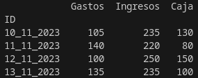
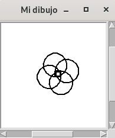
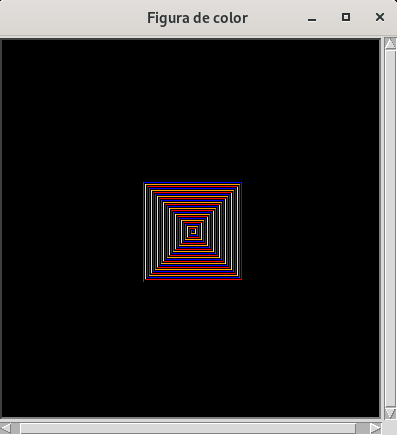

# Lesson plan
  
  ** this file should contain teacher lesson plan details ** 

  __ students will never see this __

  ## Objetivos de aprendizaje en este módulo
  1. Familiarizarse en el uso de librerías en Python.
  2. Trabajar con librerías de ejemplo, _time_, _random_, _pandas_ o _turtle_.
  4. Repasar el funcionamiento y uso de bucles en Python (_for_, _while_...).
  6. Desarrollar métodos para la presentación avanzada de datos en pantalla.

  Más información en la página de contacto del autor 👉 [Miquel Nebot](https://miquelnebot.es).

### Solución actividad MD09 Actividad 01 (opcional)
```Python
# Librerías
import random

# Variables
numero_aleatorio = random.randint(1, 100) # Generando un número aleatorio entre 1 y 100.
contador_usuario = 0

# Ejecución
while True: # El bucle estará en ejecución hasta que el usuario adivine el número aleatorio.
    numero_usuario = int(input('Introduce un número entre 1 y 100: '))
    if numero_usuario == numero_aleatorio:
        print(f'Has adivinado el número en {contador_usuario} intentos.')
        break
    elif numero_usuario < numero_aleatorio:
        print('El número que has elegido es bajo...')
    elif numero_usuario > numero_aleatorio:
        print('El número que has elegido es alto...')

    contador_usuario += 1 # Cada vez que el bucle se repita, se incrementará el contador de intentos.
```

### Solución actividad MD09 Actividad 02
📝 [hoja_gastos_ingresos.csv](md09_librerias_assets/hoja_gastos_ingresos.csv)
```Python
# Librerías
import pandas as pd

# Ejecución
balance = pd.read_csv('hoja_gastos_ingresos.csv', sep=';', index_col=0)

print(balance)
```


### Solución actividad MD09 Actividad 03
```Python
# Importamos las librerías necesarias
from turtle import Screen, Turtle

# Invocamos y configuramos inicialmente el escenario
escenario = Screen()
escenario.bgcolor('white') 
escenario.title('Mi dibujo') 
escenario.setup(100, 100)

# Definimos la herramienta "Turtle" que se encargará de pintar el dibujo
dibujo = Turtle()
dibujo.shape('turtle')
dibujo.width(2) 
dibujo.speed(2) 

radio = 20
dibujo.circle

for x in range(4):
    dibujo.circle(radio) 
    dibujo.forward(10)
    dibujo.left(90)

dibujo.hideturtle()
escenario.exitonclick()
```


### Solución actividad MD09 Actividad 04 (opcional)
```Python
# Importamos las librerías necesarias
from turtle import Screen, Turtle

# Invocamos y configuramos inicialmente el escenario
escenario = Screen() # Creamos el escenario donde poder pintar.
escenario.bgcolor('black') # En esta ocasión nuestro escenario será negro.
escenario.title('Figura de color') # Le damos un nombre a la ventana creada.
escenario.setup(400, 400) # Indicamos de qué tamaño lo queremos.

# Definimos la herramienta "Turtle" que se encargará de pintar el dibujo
dibujo = Turtle()
dibujo.shape('turtle') # Verás como una simpática tortuga es quien realiza el dibujo.
dibujo.width(5) # Tamaño del trazo.
dibujo.speed(2) # Velocidad.
colores = ['red', 'purple', 'blue', 'green', 'orange', 'yellow']


for x in range(100):
    dibujo.pencolor(colores[x%6]) # El lápiz va cambiando entre los 6 colores disponibles.
    dibujo.width(x//100 + 1) # Ajustamos el tamaño del lápiz a medida que el dibujo avanza.
    dibujo.forward(x)
    dibujo.left(90)

dibujo.hideturtle()
escenario.exitonclick()
```

