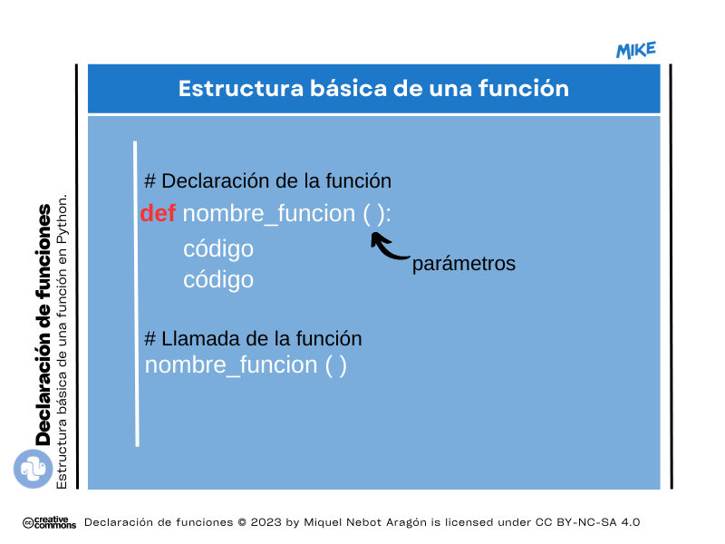
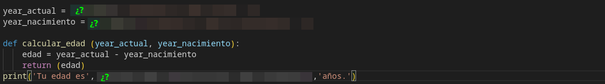

# Módulo 10. Definición o declaración de funciones

## ❓ ¿Qué es una función? 
9 lecciones atrás nos embarcamos en el reto de aprender Python de manera simple y le dimos la bienvenida usando una función integrada por defecto como es _print()_. Después de esta, hemos ido viendo muchas otras que nos han ayudado a resolver los retos propuestos además de librerías complejas que están repletas de ellas... pero, ¿qué es una función?  

__Una función es un bloque reutilizable de código que ha sido construido para realizar una función determinada__. Así pues, por ejemplo, la función _print()_ ha sido diseñada para mostrar en pantalla los resultados de las operaciones solicitadas.

Ejemplo:  
```Python
# Población española a 01/07/2023 según el INE:
poblacion = 48345223

print(f'La población española se situó en {poblacion} habitantes a 1 de julio de 2023.')
```
Resultado:
> La población española se situó en 48345223 habitantes a 1 de julio de 2023.

## ❓️ ¿Puedo definir mis propias funciones?
¡Claro que sí! En eso consiste la programación, debemos aventurarnos a desarrollar bloques de código o declaraciones que podamos reutilizar a lo largo de un mismo programa.  
Para poder hacerlo, Python utiliza la palabra clave _def_ seguida del nombre de la función y de sus parámetros entre paréntesis. La estructura es la siguiente:  



Veamos a continuación y mediante una serie de ejemplos cómo podríamos declarar funciones y posteriormente llamarlas para que se ejecutasen.  

👉️ Ejemplo 1: declaración de <ins>función muy básica SIN parámetros</ins>.

```Python
def sumar ():
    n1 = int(input('Introduce el primer sumando: '))
    n2 = int(input('A continuación, el segundo sumando: '))
    print(f'El resultado de la suma de {n1} y {n2} es {n1+n2}.')
sumar ()
```
Resultado:
> Introduce el primer sumando: 10  
A continuación, el segundo sumando: 20  
El resultado de la suma de 10 y 20 es 30.  

👉️ Ejemplo 2: como hemos visto en el ejemplo anterior, <ins>nuestra función debe retornarnos un valor</ins> por lo que podemos utilizar _return ()_ para conseguir el mismo resultado.
```Python
def sumar ():
    n1 = int(input('Introduce el primer sumando: ' ))
    n2 = int(input('A continuación, el segundo sumando: '))
    suma = n1 + n2
    return suma
print(sumar())
```
Resultado:
> Introduce el primer sumando: 10  
A continuación, el segundo sumando: 20  
30  

👉️ Ejemplo 3: avanzamos algo más con <ins>otro ejemplo SIN parámetros</ins>.
```Python
def imprimir_materias():
  while True:
    asignaturas = ['Mates','Lengua','Ciencias','Tecnología']
    seleccion = int(input('Del 0 al 3, di qué asignatura quieres ver: '))
    if seleccion == 0:
        print(asignaturas[0])
        break
    elif seleccion == 1:
        print(asignaturas[1])
        break
    elif seleccion == 2:
        print(asignaturas[2])
        break
    elif seleccion == 3:
        print(asignaturas[3])
        break
    else:
        print('Opción incorrecta. ¡Introduce un número válido!')

imprimir_materias()
```
---
### 👌 MD10 Actividad 01 (opcional)
Después de ver el ejemplo anterior, aunque válido, podemos confirmar que <ins>se puede optimizar mucho el código eliminando el bucle _while()_, ¿sabrías hacerlo?</ins> ¡No te preocupes en absoluto que en esta actividad 100 % guiada te explicamos cómo hacerlo!  
La solución al problema está en la definición de la condición que debemos plantear 👇️:
 
```Python
def imprimir_materias():
    asignaturas = ['Mates', 'Lengua', 'Ciencias', 'Tecnología']
    seleccion = int(input('Del 0 al 3, di qué asignatura quieres ver: '))
    
    if 0 <= seleccion < len(asignaturas): # De esta forma nos aseguramos que introduce un valor que esté dentro del rango solicitado, entre 0 y 3.
        print(asignaturas[seleccion])
    else:
        print('Opción incorrecta. ¡Introduce un número válido!')

imprimir_materias()
```
Explicamos esta parte fundamental de la sentencia condicional 👇️ con 2 ejemplos:
```Python
if 0 <= seleccion < len(asignaturas) # La longitud de asignaturas es 4.
```

* Si el usuario introduce por ejemplo un 7:
    * 0 es menor o igual que 7 (TRUE) pero no es menor que 4 (así que, FALSE). El bucle salta hasta la parte de la sentencia _else()_.
* Si el usuario introduce un 3:
    * 0 es menor o igual que 3 (TRUE) y es menor que 4 (TRUE). El condicional pasa a la función print().

---
👉️ Ejemplo 4: en una función podemos <ins>pasar diferentes tipos de datos como parámetro de dicha función</ins>.

```Python
def saludo (nombre):
    mensaje = nombre + ', bienvenido/a a mi aplicación.'
    return mensaje
print(saludo('Ángel'))
```
Resultado:
> Ángel, bienvenido/a a mi aplicación.  

👉️ Ejemplo 5: también podría darse que el <ins>parámetro fuese fijo...</ins>
```Python
def saludo(nombre = 'Charly'):
    mensaje = nombre + ', bienvenido/a a mi aplicación.'
    return mensaje
print(saludo())
print(saludo('Araceli')) # Podríamos así modificar el dato fijo establecido en el parámetro.
```
Resultado:
> Charly, bienvenido/a a mi aplicación.  
Araceli, bienvenido/a a mi aplicación.  

👉️ Ejemplo 6: introducimos <ins>2 parámetros</ins> en nuestra función.
```Python
def calcular_edad (year_actual, year_nacimiento):
    edad = year_actual - year_nacimiento
    return (edad)
print('Tu edad es', calcular_edad(2023, 1977),'años.')
```
Resultado:
> Tu edad es 46 años.

---
### 🔴 MD10 Actividad 02
Fíjate en el ejemplo anterior (_Ejemplo 6_) y <ins>redefine la función _calcular_edad_ para que sea el propio usuario el que tenga que introducir el año actual y su año de nacimiento</ins> como 2 variables típicas. Fíjate en la siguiente captura que, aunque tenga partes por descubrir, seguro que te es de muchísima ayuda para conseguir el reto propuesto.



---
### 🔴 MD10 Actividad 03
Define ahora tú una función que te ayude a <ins>calcular el área de un triángulo</ins>. Deberás hacer que sea el propio usuario quien te introduzca los datos necesarios para realizar el cálculo (base y altura).

---


# 🤗 Resumen del Módulo 10

Hasta aquí la décima lección con aspectos básicos sobre Python. Recuerda que deberías retener los siguientes conceptos:
1. Declaración de una función.
2. _def ()_.
3. Parámetros.
4. Sentencias condicionales.
5. Bucles.
