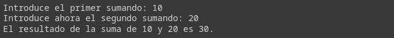
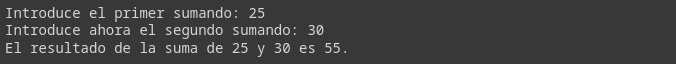
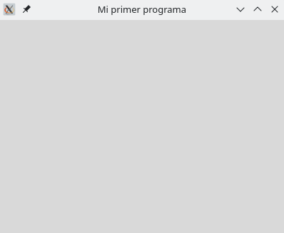
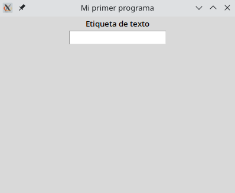
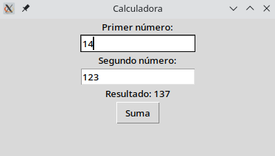

# Módulo 11. Mi primera interfaz gráfica

## ❓ ¿Aburrido/a de interactuar siempre con la terminal? 
Llegamos al final y lo hacemos descubriendo las bondades de [_Tkinter_](https://docs.python.org/3/library/tkinter.html), una librería muy especial que hará posible crear interfaces gráficas para nuestras aplicaciones. Veamos, mediante un sencillo ejemplo, cómo funciona y cuáles son sus posibilidades a nivel de iniciación.


👉️ Ejemplo 1: una calculadora sencilla (Opción 1️⃣).
```Python
# Creando una calculadora de, por ejemplo, sumas
numero1 = int(input('Introduce el primer sumando: '))
numero2 = int(input('Introduce ahora el segundo sumando: '))
resultado = numero1 + numero2
print(f'El resultado de la suma de {numero1} y {numero2} es {resultado}.')

```
Resultado:
>

## ❓️ ¿Puedo avanzar en la programación anterior y definir una función?
¡Claro que sí! En eso consiste la programación, debemos aventurarnos a desarrollar bloques de código o declaraciones que podamos reutilizar a lo largo de un mismo programa.  
Para poder hacerlo, Python utiliza la palabra clave _def_ seguida del nombre de la función y de sus parámetros entre paréntesis.
  
👉️ Ejemplo 2: una calculadora sencilla definiendo una función.

```Python
def sumar ():
    numero1 = int(input('Introduce el primer sumando: '))
    numero2 = int(input('Introduce ahora el segundo sumando: '))
    print(f'El resultado de la suma de {numero1} y {numero2} es {numero1+numero2}.')
sumar ()
```
Resultado:
>

## ❓️ ¿Y si quiero huir ya de la terminal y tener una interfaz gráfica en mi programa?
Para ello deberemos introducir la librería _Tkinter_ que funciona básicamente de la siguiente manera:

👉️ Ejemplo 3: probando _Tkinter_ para diseñar una interfaz vacía con título y un tamaño determinado.

```Python
# Importación de módulos y creación de alias
import tkinter as tk

# Diseño de nuestra interfaz gráfica
aplicacion = tk.Tk() # Invocamos a la función de creación de una interfaz
aplicacion.title('Mi primer programa') # Título para la ventana de la aplicación
aplicacion.geometry('400x300') # Establecemos un tamaño de pantalla de 400 x 300 px

aplicacion.mainloop() # Este comando inicia el bucle principal de la interfaz gráfica
```
Resultado:
>

## ❓️ ¿Añadimos ahora texto y casillas?
Una parte importante es la que se describe a continuación. Para poder hacer visibles los elementos, después de crearlos, debemos con la opción _.pack_ empaquetarlos para verlos en pantalla.  

👉️ Ejemplo 4: introducimos elementos o _widgets_ a nuestro programa.
```Python
# Importación de módulos y creación de alias
import tkinter as tk

# Diseño de nuestra interfaz gráfica
aplicacion = tk.Tk() 
aplicacion.title('Mi primer programa') 
aplicacion.geometry('400x300') 

etiqueta1 = tk.Label(text='Etiqueta de texto') # Etiqueta de texto
entrada1 = tk.Entry() # Cuadro de entrada de valores

etiqueta1.pack() # Empaquetado del primer elemento
entrada1.pack() # Empaquetado del segundo elemento

aplicacion.mainloop() 
```
Resultado:
>
---
### 👌 MD11 Actividad 01 (opcional)
Después de ver el ejemplo anterior, practica creando tu propia ventana de aplicación. Añade un título y un total de 3 elementos en pantalla.  

➕ Fíjate en el ejemplo siguiente cómo puedes cambiar, por ejemplo, el color del fondo de tu aplicación a blanco. Recuerda que tienes toda la información sobre esta biblioteca [aquí](https://docs.python.org/es/3/library/tkinter.html). 
 
```Python
# Importación de módulos y creación de alias
import tkinter as tk

# Diseño de nuestra interfaz gráfica
aplicacion = tk.Tk() 
aplicacion.title('Miquel\'s APP') 
aplicacion.geometry('400x400') 
aplicacion.configure(background='#ffffff')

etiqueta1 = tk.Label(text='Introduce tu nombre') # Etiqueta de texto
entrada1 = tk.Entry() # Cuadro de entrada de valores

etiqueta1.pack() # Empaquetado del primer elemento
entrada1.pack() # Empaquetado del segundo elemento

aplicacion.mainloop() 
```
---
## ❓️ ¡Vamos a por nuestra primera aplicación!
👉️ Ejemplo 5: después de analizar los ejemplos anteriores veamos qué necesitamos para diseñar nuestra calculadora para realizar sumas de manera atractiva.

```Python
# Importación de módulos y creación de alias
import tkinter as tk

# Función principal
def sumar():
    num1 = int(entrada_num1.get())
    num2 = int(entrada_num2.get())
    resultado = num1 + num2
    etiqueta_resultado.config(text='Resultado: ' + str(resultado))

# Creación de la interfaz gráfica
aplicacion = tk.Tk()
aplicacion.title('Calculadora')
aplicacion.geometry('400x200')

## Creación de los elementos o widgets que conformarán la aplicación
etiqueta_num1 = tk.Label(text='Primer número:')
entrada_num1 = tk.Entry()

etiqueta_num2 = tk.Label(text='Segundo número:')
entrada_num2 = tk.Entry()

etiqueta_resultado = tk.Label(text='--')

boton_sumar = tk.Button(text='Suma', command=sumar)

## Empaquetado de todos los elementos para que sean visibles en pantalla
etiqueta_num1.pack()
entrada_num1.pack()
etiqueta_num2.pack()
entrada_num2.pack()
etiqueta_resultado.pack()
boton_sumar.pack()

aplicacion.mainloop()
```
Resultado:
> 

---
### 🔴 MD10 Actividad 02
Fíjate en el ejemplo anterior (_Ejemplo 5_) y <ins>redefine la función _sumar_ para crear una nueva función para tu calculadora</ins>. Puedes restar, multiplicar, dividir, efectuar potencias... ¡Da rienda suelta a tu imaginación!

---
### 🔴 MD10 Actividad 03
Define ahora tú una función que te ayude a <ins>calcular el área de un triángulo</ins>. Deberás hacer que sea el propio usuario quien te introduzca los datos necesarios para realizar el cálculo (base y altura).

---


# 🤗 Resumen del Módulo 11

Hasta aquí la undécima lección con aspectos básicos sobre Python. Recuerda que deberías retener los siguientes conceptos:

1. Repasos de declaración de una función.
2. Importación de librerías en Python.
3. Librería _Tkinter_.

  
